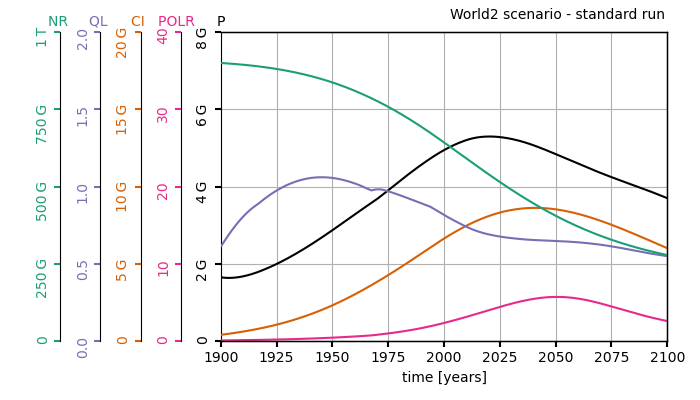

# The WorldOptim library

<p align="center">

</p>
<p align="center">
 <em>Evolution of the main variables of the World2 dynamical models in the 'business as usual' scenario.</em>
</p>

The WorldOptim suite is a library that allows to interface optimization algorithms with models of world dynamics. Epidemiological models are wrapped in OpenAI Gym
interfaces, making them readily compatible with state-of-the-art optimization algorithms. Check out my [blog post](https://ccolas.github.io//blog/worldoptim) on the topic.

### Background

In the early 1970s, an international group of researchers called the [club of Rome](https://www.clubofrome.org) was tasked to study the implication of a continued worldwide
growth. This led to the edition of [_The Limits to Growth_](https://www.clubofrome.org/publication/the-limits-to-growth/) a book that
remains a reference in the current ecological debate. Its conclusions still hold today: the Earth cannot support present rates of economic and population growth much beyond the
year 2100, even considering technological improvements.

Their conclusions are based on World2 and World3, two dynamical models featuring five basic factors that determine and, in their interactions, ultimately limit growth on this
planet---population increase, agricultural production, nonrenewable resource depletion, industrial output, and pollution generation. Fitted on real data, this model predicts
the global evolution of these five factors and reaches dark conclusions: a peak of population around 2025 followed by a decrease in population, capital investment and
general quality of life (see graph above). Although the model is not predictive per se, it highlights the general tendencies: the continual economic growth and the consumption of
natural resources that is tied to it, will lead our modern societies to their end.

In _Limits to Growth_, the authors investigated 5 scenarios. In each scenario, they modify by hand some of the model's parameters. What if the stock of natural
resources was twice what we think it is? What if we could divide by 2 the amount of pollution emitted per unit of capita? etc. With modern machine learning methods, **we can
automatize this process, run simulations, and let an optimization algorithm explore the space of mitigation policies to optimize for a given cost function**.

### What's already there
This library is designed to be easily customized. The underlying propagation model, reward function, state and action spaces can be modified easily.

* **World dynamics models**: This library comes an implementation of the World2 model developed by Jay W. Forrester in 1971. Original Python implementation [here](https://github.com/cvanwynsberghe/pyworld2).

* **Cost functions**: we include a cost function computed as a negative quality of life and a cost function growing exponentially with the death rate as soon as the death rate 
  passes a threshold placed at the death rate level of 1970.

* **Learning environments**: The 'World2Discrete-v0' environment wraps around the World2 model and the two cost functions described above. The agent controls the 
some variables of the world2 model to minimizes its future costs. 

* **Optimization algorithms**: The library includes [NSGA-II](https://ieeexplore.ieee.org/stamp/stamp.jsp?arnumber=996017), [Deep Q-Networks](https://www.datascienceassn.
  org/sites/default/files/Human-level%20Control%20Through\%20Deep%20Reinforcement%20Learning.pdf) (DQN), and variants of DQN. Only NSGA-II was tested.

### Requirements

The WorldOptim library runs with Python>=3.6. All requirements are listed in the `requirements.txt` file.

### Running an experiment

Experiments can be run with the `worldoptim/train.py` script:

```
python train.py --config nsga_ii --expe-name nsga_study --trial_id 0
```

The `--config` argument selects one of the configurations defined in `worldoptim/configs/`. They include: ['dqn', 'goal_dqn', 'goal_dqn_constraints', 'nsga_ii'].
The `--expe_name` and `--trial_id` arguments are a string identifier of the exeperiment and an integer identifier of the specific run that will be used to organized results in 
the `data/results/` folder. 
 
### How to customize it

* **Add a module**: dynamical models, cost functions, gym environments or optimization algorithms can be added to the library. To this end, a new python script containing 
the module class should be created in `worldoptim/environments/models/`, `worldoptim/environments/cost_functions/` ,`worldoptim/environments/gym_envs/` or 
`worldoptim/optimization/` respectively. They should inherit the corresponding base classes `BaseModel`, `BaseCost`, `BaseEnv` or `BaseAlgorithm` respectively. Finally, their 
reference should be added to their respective get functions (e.g. `worldoptim/environments/models/get_model.py`).

  
Please report any bug to us!

